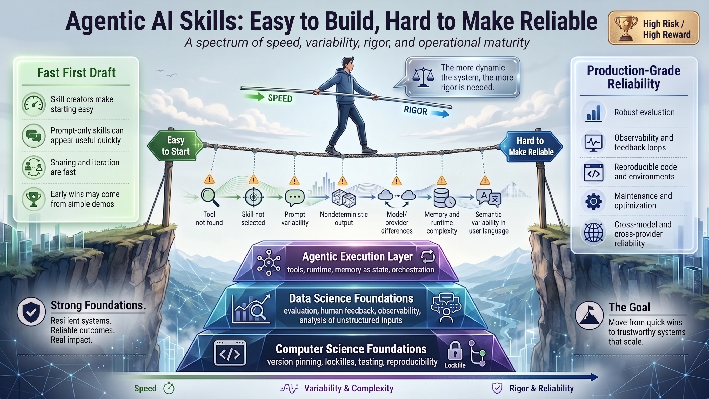

# Spectrum of skill sophistication

*A spectrum of speed, variability, rigor, and operational maturity.*

Someone on an operations team writes a small AI skill to turn messy meeting notes into a client follow-up. It works on the first few examples. The notes are clearer, the team saves time, and a task that used to begin with a blank page now has a useful first draft.

That is a meaningful win. It shows that the team's knowledge can be turned into a repeatable starting point.

Then the work changes. A colleague uses different words. The notes come from a different kind of meeting. The agent has access to a calendar, a CRM, or an internal knowledge base. A model is updated. The workflow starts carrying context from an earlier task. Someone asks whether it can be used for every customer-facing summary.

The question is no longer only, “Can we make this skill?” It becomes, “What would help us trust it with this work?”

This is where computer science and data science matter. They give business professionals useful habits from the beginning of an AI experiment: record the conditions, test the important cases, watch what happens, learn from feedback, and make changes carefully. Those habits help a team preserve the speed of a first draft while learning when a workflow is ready for broader use.

The image calls that journey operational maturity. It is the team's growing ability to own the workflow: to know what it is for, see how it behaves, improve it when it falls short, and decide how much trust it has earned.

## Contents

- [A quick win is a beginning](#a-quick-win-is-a-beginning)
- [Professional use creates more handoffs](#professional-use-creates-more-handoffs)
- [Where variability enters](#where-variability-enters)
- [Computer science makes conditions repeatable](#computer-science-makes-conditions-repeatable)
- [Data science turns use into evidence](#data-science-turns-use-into-evidence)
- [Agentic execution adds useful moving parts](#agentic-execution-adds-useful-moving-parts)
- [Rigor should match the promise](#rigor-should-match-the-promise)
- [The goal is trustworthy scale](#the-goal-is-trustworthy-scale)

## A quick win is a beginning

The left side of the illustration is called “Fast First Draft,” and it captures something worth protecting. Skill creators make starting easy. Prompt-only skills can appear useful quickly. Sharing and iteration are fast. Early wins often come from simple demos.

That accessibility lets people who understand the work best take part in shaping the workflow. A recruiter can describe what a useful candidate brief contains. A project manager can show how a risk update should be organized. A support lead can identify the details that keep a response helpful and calm. They do not have to wait for a large software project before they can test an idea.

The green sign, “Easy to Start,” is an invitation to experiment. It does not promise that every early result will carry the same weight as a system that other people depend on. A demo usually has a small set of examples, a familiar author nearby, and a person ready to notice and correct a weak result. That is an appropriate setting for a first draft.

The “High Risk / High Reward” badge belongs in the picture because agentic AI can increase the reach of good professional judgment. A dependable workflow can reduce rework, make a service more consistent, and help a team apply its hard-won knowledge more often. The risk comes from giving a workflow a bigger promise than the evidence supports.

## Professional use creates more handoffs

The person on the tightrope is balancing speed against rigor. Speed keeps learning moving. Rigor asks the team to slow down long enough to understand what the workflow needs before others rely on it.

The relay-race analogy helps here. A skill is the baton, but it passes through many hands: the person who writes it, the mechanism that discovers it, the model that decides whether to use it, the tools it calls, the runtime that supplies context, and the people who describe their work in everyday language. A good result depends on each handoff.

This is what the image means by a dynamic system. A dynamic workflow has more than one fixed instruction and one predictable response. It may select steps, use approved tools, carry information from earlier work, respond to changing data, or work across different models and providers. Those capabilities create value. They also introduce more conditions that can affect the outcome.

“The more dynamic the system, the more rigor is needed” is a proportionate rule for using agentic workflows. A private helper that drafts an outline for one person needs a lighter set of safeguards than a workflow that sends customer messages, changes records, or informs a decision for many people.

## Where variability enters

The warning markers under the tightrope name seven ordinary sources of uncertainty. They are connected because a workflow can be affected by more than one at once.

1. “Tool not found” means a workflow expects a file, integration, permission, or service that is unavailable at the moment it runs. The agent needs a clear fallback rather than a silent failure or a guess.
2. “Skill not selected” means a helpful skill has no effect if the agent cannot find it or decides another instruction fits the request better. Teams need examples that show when the skill should and should not be used.
3. “Prompt variability” describes the way people leave out context, use unfamiliar terms, and frame the same task in different ways. A request from a sales lead can describe the same need very differently from a request from legal or customer support.
4. “Nondeterministic output” means generative models can produce different wording, reasoning, or choices from similar requests. The practical task is to identify which variation is acceptable and which would create a problem.
5. “Model and provider differences” matter because models differ in their capabilities, tool use, context handling, and safety behavior. A workflow that works well in one environment needs evidence before a team assumes it will behave the same way in another.
6. “Memory and runtime complexity” means earlier conversations, tool results, timing, and state can change what the agent sees and does. A remembered detail can help. It can also be outdated, irrelevant, or attached to the wrong task.
7. “Semantic variability in user language” means matching words is different from understanding intent. “Make this client-ready,” “write a recap,” and “prepare the follow-up” may point to the same outcome, or they may carry important differences that the workflow needs to recognize.

None of these conditions means the original author did poor work. They are part of working with natural language, changing software, and systems that act at runtime. The blue sign, “Hard to Make Reliable,” names the next phase of the work: making these conditions visible, testing the ones that matter, and deciding how the workflow should respond.

## Computer science makes conditions repeatable

Computer science foundations help a team create the same tested starting conditions again. In plain language, they are the practices that make a workflow easier to repeat, inspect, change, and recover.

Consider a skill that includes code or depends on other software. It might work beautifully on the author's computer, then fail after a library update changes a behavior the author never intended to touch. Version pinning records the approved version of a dependency. A lockfile records the exact collection of software ingredients that were tested together. These are less glamorous than a demo, but they prevent a quiet change from becoming a mystery later.

Testing serves a similar purpose. A test is a repeatable check against a known scenario. For an agentic workflow, that might mean checking whether the right skill is selected for a few representative requests, whether an unavailable tool produces a safe response, or whether a change still produces an acceptable draft. The test does not prove that the workflow will handle every future situation. It gives the team a stable way to notice when an important behavior has changed.

Reproducibility is the practical benefit. When a result is especially good, a team should be able to understand the conditions that produced it. When a result is poor, the team should have enough information to investigate without guessing. This is why the image places version pinning, lockfiles, testing, and reproducibility at the bottom of its pyramid. They support the rest of the work.

Computer science also brings safe change control. Who can update the instructions or code? What is checked before an update reaches users? What happens if a tool is unavailable? How does the team roll back a change that creates a problem? These questions keep a useful workflow from becoming fragile as it grows.

## Data science turns use into evidence

Data science foundations answer a different set of questions: Is the workflow helping? For whom? Under which conditions? Where does it fall short?

This work does not begin with advanced statistics or a sophisticated dashboard. It can begin with a small collection of representative requests and knowledgeable people reviewing the outcomes. A team might gather examples of meeting notes, customer questions, or project updates that reflect the range of work it expects to support. Reviewers can mark which outputs were useful, incomplete, unsafe, or off target, then explain why.

That human feedback matters because professional quality is often partly contextual. A concise executive update, a respectful customer response, and a legally cautious summary each need different judgment. The people who know the work can help define what “good” looks like before anyone tries to automate the measure.

The image also names analysis of unstructured inputs. Unstructured input means the messy language people use in real work: abbreviations, shorthand, partial questions, industry terms, and requests that assume shared context. Data science gives a team ways to sample that variety, look for patterns in weak outcomes, and decide whether the workflow is helping across the range of requests rather than only in a polished demo.

Evaluation turns those observations into a deliberate routine. It may begin with a reviewer comparing outputs against a clear standard. As the workflow reaches more people, the team can add a broader set of examples, track agreed measures, and separate cases used to improve the skill from cases used to check whether the improvement holds up.

Observability and feedback loops keep the routine connected to real use. Observability means being able to see enough of a run to understand what the workflow received, which skill and tools it used, what it produced, and where it stopped. A feedback loop uses that evidence to improve the next version. Together, they let a team learn from patterns instead of relying on a few memorable anecdotes.

## Agentic execution adds useful moving parts

The top of the pyramid is the “Agentic Execution Layer”: tools, runtime, memory as state, and orchestration. This is the layer where an AI system can coordinate steps across a task rather than simply return one response to one prompt.

Tools let an agent look up approved information, retrieve a document, create a draft in another system, or take another defined action. The runtime is the environment that provides those tools and keeps the work moving. Memory as state gives the workflow information from earlier steps or earlier interactions. Orchestration is the plan for how the pieces work together and when the workflow should ask for help.

Each capability can make a workflow more useful. Together, they make the behavior more like a running service than a static document. That is why the agentic layer sits on data science and computer science foundations in the image. Evidence, repeatability, and careful maintenance remain necessary. The model and the prompt make those habits more valuable.

## Rigor should match the promise

Production-grade reliability grows through a set of practices that match the workflow's reach, autonomy, and consequences.

| When a workflow promises... | A team can begin with... | As the promise grows... |
| --- | --- | --- |
| A reviewed assist for one person | Clear instructions, a narrow purpose, and a person who checks every result | More examples when the task starts recurring or the scope changes |
| A reusable helper for a team | Representative requests, human feedback, and a clear answer to “when should this skill be selected?” | Evaluation across different language, users, and work conditions |
| Tool use, code, or retained context | Approved permissions, repeatable environments, checks for important paths, and a recovery plan | Logs, maintenance ownership, and tested changes before release |
| Broad or consequential professional work | Clear limits, escalation paths, and accountable review | Ongoing evaluation, observability, cross-model and cross-provider checks, and a named team responsible for improvement |

The production-grade reliability panel on the right side of the image gives this progression a practical vocabulary. “Robust evaluation” means checking the workflow against meaningful work, including scenarios outside a single happy path. Observability and feedback loops help a team see when results drift and learn what to improve. Reproducible code and environments make it possible to recreate a run and make a change with confidence. Maintenance and optimization recognize that tools, models, policies, and user needs will keep changing. Cross-model and cross-provider reliability asks a sensible question before a platform change becomes a surprise: does the workflow still meet its promise in the environment where people will use it?

Proportionate rigor can remain small and focused. The work is to invest enough care to support the promise being made. The tightrope remains balanced when speed and rigor work together.

## The goal is trustworthy scale

The image ends with “Strong Foundations”: resilient systems, reliable outcomes, and real impact. These are professional outcomes. A resilient system can handle ordinary change and failure without leaving people stranded. A reliable outcome gives colleagues a reason to use the workflow again. Real impact comes when good judgment becomes easier to apply across a team.

The goal is to move from quick wins to trustworthy systems that scale. The first draft still matters because it reveals a useful opportunity. The next steps make that opportunity safer to share: clarify the promise, collect real examples, decide what needs human review, record the conditions that matter, and learn from results over time.

The bottom arrow in the image makes the direction clear: speed is followed by variability and complexity, then by rigor and reliability. Computer science and data science give teams a way to travel that path together. They turn agentic AI from a moment of impressive output into a professional workflow that people can understand, improve, and rely on.
